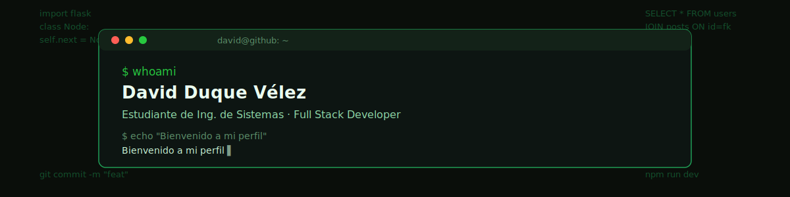

  <a href="README.md">🇪🇸</a> · <a href="README_en.md">🇺🇸</a>

  

  

---

### 🚀 Sobre mí

Ingeniería de Sistemas, casi en la recta final de mis estudios técnicos en Medellín, con la mira puesta en un programa tecnológico de mayor nivel. Entre clases he preferido aprender construyendo: **RutaXRuta** me llevó a lidiar con mapas interactivos y geolocalización en tiempo real, y **NEXUS** a diseñar una base de datos relacional desde cero y defenderla en sustentación.

Me interesa el desarrollo full stack completo — desde modelar el esquema de una base de datos hasta resolver por qué una animación rompe el layout en mobile.

- 🔭 Trabajando en proyectos full stack con **Next.js**, **Flask** y **MySQL**
- 💬 Abierto a hablar de Python, Flask, React o diseño de bases de datos
- 📫 **david11duquev@gmail.com**

---

### 🧩 Lo que me gusta resolver

- Bugs de integración entre frontend y backend — el tipo de error que solo aparece al conectar todo
- Diseño de esquemas de bases de datos: normalización, relaciones N:M, claves foráneas bien pensadas
- Problemas de responsividad que rompen en mobile aunque en desktop todo se ve perfecto
- Decisiones de arquitectura simples: cuándo una solución mínima es mejor que una "elegante"

---

### 🛠️ Stack tecnológico

  

---

### 📚 Actualmente aprendiendo

  

Sumando **Java** y **Spring Boot** a mi stack para tener una base sólida en desarrollo backend orientado a objetos, de cara a mi próximo programa tecnológico.

---

### 💼 Proyectos destacados

| Proyecto | Descripción | Stack |
|---|---|---|
| 🚗 **[RutaXRuta](https://github.com/sudo-david/rutaxruta)** | App de carpooling con mapas interactivos para coordinar rutas compartidas | `Next.js` `React` `Tailwind` `Leaflet.js` `MySQL` |
| 🌐 **NEXUS** | Red social construida como proyecto de bases de datos — CRUD completo, autenticación segura, arquitectura Blueprint | `Flask` `MySQL` `Tailwind` `bcrypt` |

---

### 📊 Estadísticas de GitHub

  
  

  

---

### 🐍 Actividad de contribuciones

  

---

### 📬 Conéctate conmigo

  
  
  

  

