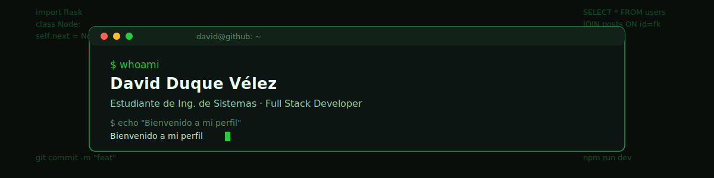

  <a href="README.md"> ESPAÑOL</a> · <a href="README_en.md"> ENGLISH</a>

  

  
  

---

### 🚀 About me

Systems Engineering student, close to wrapping up my technical studies in Medellín, with my sights set on a higher-level technology program next. I've preferred learning by building: **RutaXRuta** had me dealing with interactive maps and real-time geolocation, and **NEXUS** had me designing a relational database from scratch and defending it in a live presentation.

I'm interested in full stack development end to end — from modeling a database schema to figuring out why an animation breaks the layout on mobile.

- 🔭 Working on full stack projects with **Next.js**, **Flask**, and **MySQL**
- 💬 Happy to talk about Python, Flask, React, or database design
- 📫 **david11duquev@gmail.com**

---

### 🧩 What I like solving

- Frontend/backend integration bugs — the kind that only show up once everything is connected
- Database schema design: normalization, N:M relationships, well-thought-out foreign keys
- Responsiveness issues that break on mobile even when desktop looks perfect
- Simple architecture decisions: knowing when a minimal solution beats an "elegant" one

---

### 🛠️ Tech stack

  

---

### 📚 Currently learning

  

Adding **Java** and **Spring Boot** to my stack to build a solid foundation in object-oriented backend development, ahead of my next technology program.

---

### 💼 Featured projects

| Project | Description | Stack |
|---|---|---|
| 🚗 **[RutaXRuta](https://github.com/sudo-david/rutaxruta)** | Carpooling app with interactive maps for coordinating shared rides | `Next.js` `React` `Tailwind` `Leaflet.js` `MySQL` |
| 🌐 **NEXUS** | Social network built as a database course project — full CRUD, secure auth, Blueprint architecture | `Flask` `MySQL` `Tailwind` `bcrypt` |

---

### 📊 GitHub stats

  
  

  

---

### 🐍 Contribution activity

  

---

### 📈 Activity graph

  

---

### 📬 Get in touch

  
  
  

  

